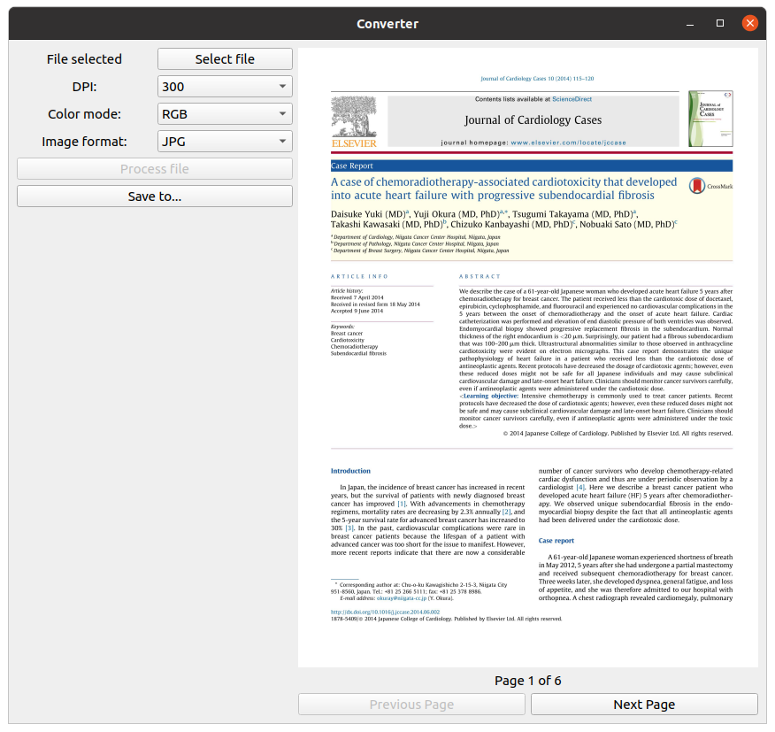

# Pdf to image
This application is designed to simplify converting data from PDF to PNG or JPG 
format.  

With this application, you can easily convert PDF documents, even if they have 
multiple pages, to images.  



## Installation
### Python
To install this application directly to Python, you must first clone this
repository using 
command:
```commandline
git clone https://github.com/IHappyPlant/Pdf_Converter.git
```
Then, install converter to Python with command:
```commandline
python setup.py install
```
Now you can run application from any place using following command:
```commandline
python -m converter
```
### Windows
For Windows, you must first download 
[poppler](https://blog.alivate.com.au/poppler-windows/) for Windows, and add its
```bin/``` folder to PATH.  
Then, you can download and run latest application release for Windows, or 
install application [directly to Python](#python).
 
 ### Debian / Ubuntu
 Just download and run latest application release for Linux, or install
 application [directly to Python](#python).
 
 ### Other Linux distros
 It is similar to [Debian / Ubuntu](#debian--ubuntu) installation, but you may
 need first install ```poppler-utils``` package with your package manager.
 